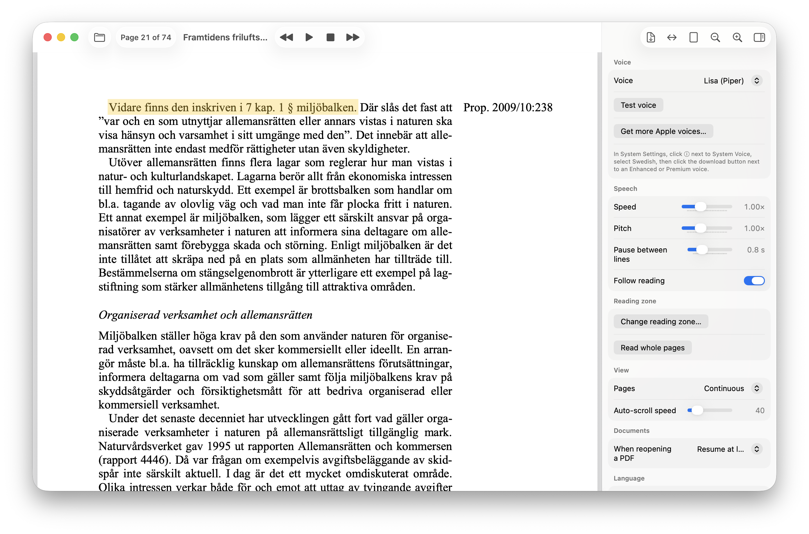

# Läsa

**Läsa** (Swedish for *to read*) is a Mac app that reads PDFs aloud in Swedish. Open a PDF, press Space, and Läsa reads it to you sentence by sentence, highlighting where it is on the page.

Everything happens on your Mac. There is no account, no subscription, and nothing is uploaded. After installation it works offline.



*Läsa reading [Framtidens friluftsliv](https://www.regeringen.se/rattsliga-dokument/proposition/2010/07/prop.-200910238) (Prop. 2009/10:238, regeringen.se) with the Lisa voice. A reading zone is set, so the running header "Prop. 2009/10:238" in the margin and the page numbers are skipped.*

## What makes Läsa different

- **It reads scanned PDFs, not just "real" text.** Many books and course packs are photos of pages with no text inside. Most readers fall silent on those. Läsa recognises the text on the page itself (with the Mac's built-in text recognition) and reads it like any other PDF.

- **You can set a reading zone, so headers and page numbers stop interrupting.** Books repeat the same running header and a page number on every page. When a PDF is read aloud, those land in the middle of the text, page after page:

  > "…tas upp i tarmen och bryts ned i — *47* — *Kapitel 3 Farmakologi* — levern. Därefter…"

  With a reading zone you draw a box around the main text **once**, and Läsa skips everything outside it (headers, footers, page numbers, margin notes) on **every page** of that PDF. You hear the book, not the page furniture. It works on scanned PDFs too, and Läsa remembers the zone for each PDF.

- **You choose the voice.** Läsa comes with three natural-sounding Swedish neural voices (Lisa, Alma and NST) that work offline. It can also use the Swedish voices built into macOS, including Apple's high-quality **Premium** and **Enhanced** voices such as *Alva*. With an Apple voice, Läsa also highlights each word as it is spoken. Every voice keeps its own speed and pitch.

- **The interface speaks your language.** Menus and settings are in Swedish when your Mac is set to Swedish and in English otherwise. You can also pick the language yourself.

## Requirements

- A Mac with Apple silicon (M1 or later). Intel Macs are not supported.
- macOS 14 Sonoma or later.
- About 300 MB of free space.

## Install

### Quick install (recommended)

Open **Terminal** (in Applications → Utilities) and paste this line, then press Return:

```sh
curl -fsSL https://raw.githubusercontent.com/codingtony/lasa/main/scripts/install.sh | bash
```

It checks that your Mac is supported, downloads the latest version of Läsa (about 200 MB), installs it in **Applications** (or in **Applications** inside your home folder if you can't write to the main one), and opens it. No password is needed, and macOS doesn't ask you to approve the app.

To update Läsa later, run the same line again. It replaces the old version and keeps your settings.

### Install from the disk image

1. Download `Lasa.dmg` from the [latest release](https://github.com/codingtony/lasa/releases/latest).
2. Open it and drag **Läsa** onto the **Applications** shortcut. (`Lasa.zip` works too: unzip it and move **Läsa** into **Applications**.)
3. Open Läsa. The first time, macOS blocks it because it is not from an identified developer. Go to **System Settings → Privacy & Security**, scroll down and click **Open Anyway**.
   Alternatively, run this once in Terminal: `/usr/bin/xattr -dr com.apple.quarantine /Applications/Läsa.app`

### Better Apple voices (optional, but strongly suggested)

Apple's *Enhanced* and *Premium* Swedish voices sound much better than the standard ones. To install them:

1. In Läsa, open the settings sidebar and click **Get more Apple voices…** under **Voice**. System Settings opens at Spoken Content.
2. Click the **ⓘ** button next to **System Voice**.
3. Select **Swedish** in the left panel.
4. Click the download button (a cloud with an arrow) next to the voice you want. Choose an **Enhanced** or **Premium** voice (for example *Alva*) for the best results.

The voice shows up in Läsa's voice list as soon as the download finishes.

## Using Läsa

1. Open a PDF: press **⌘O**, drag a PDF onto the window, or open it with Läsa from Finder.
2. Press **Space** to start reading from the top of the page you are looking at.
   - To start somewhere else, click a word (or select some text) first, then press Space.
   - Or right-click anywhere on a page and choose **Read from here**.
3. While Läsa reads, click any word to jump there. Press Space again to pause.

Reading continues through the whole document, and the page scrolls along with the voice. When you reopen a PDF, Läsa offers to continue on the page where you stopped.

### Setting a reading zone

1. Open the settings sidebar (the sidebar button at the right of the toolbar).
2. Under **Reading zone**, click **Set reading zone…**. The page dims outside the current zone.
3. Drag a rectangle around the main text on any page, leaving out the header at the top and the page number at the bottom. Click **Done**.

The zone applies to every page of that PDF and is remembered next time you open it. Use **Change reading zone…** to redraw it, or **Read whole pages** to remove it. A line is read when its middle is inside the zone.

### Choosing a voice

Pick a voice under **Voice** in the settings sidebar, and use **Test voice** to hear it.

- **Lisa, Alma, NST (Piper):** natural neural voices bundled with Läsa. Lisa is used until you choose another voice.
- **Apple voices:** every Swedish voice installed on your Mac. *Alva (Premium)* is the best of them, and Apple voices highlight each word as it is spoken. Use **Get more Apple voices…** to download them (see [Better Apple voices](#better-apple-voices-optional-but-strongly-suggested)).

Speed, pitch and the pause between lines are under **Speech**. Each voice remembers its own speed and pitch, so you can keep a slow voice for new material and a fast one for revision.

### Interface language

By default, Läsa follows your Mac's language: Swedish on a Mac set to Swedish, English otherwise. To choose yourself, open the settings sidebar, go to **Language → Interface language**, choose **English** or **Svenska**, and click **Restart Now**. The spoken text is always read with the Swedish voice you picked, whatever the interface language.

### Keyboard shortcuts

| Key | Action |
|---|---|
| Space | Play / pause |
| ⌘. | Stop |
| ⌘→ / ⌘← | Next / previous sentence |
| ⌘O | Open a PDF |
| ⌥⌘G | Go to page (or click "Page X of Y" in the toolbar) |

### Tips

- **Scanned pages:** the first time Läsa reads a scanned page, it needs about half a second to recognise the text. On scanned pages the highlight marks whole lines instead of words.
- **Multiple-choice questions run together?** Raise **Pause between lines** under Speech. Each answer option and heading gets the full pause; sentences inside a paragraph get a shorter one.
- **English text** is read with a Swedish voice and sounds accented.
- Läsa remembers everything between launches: the last PDF and page, the voice, all settings, and the reading zone of each PDF.

## Build it yourself

### What you need

- A Mac with Apple silicon running macOS 14 or later.
- The Xcode Command Line Tools with Swift 6 or later. Install them with `xcode-select --install` (the full Xcode app also works, but is not required).
- An internet connection for the first build. It downloads the speech engine and the three voices (about 300 MB) from GitHub.
- At least 2 GB of free disk space.

### Build

In Terminal, in the folder that contains this README:

```sh
./scripts/build-app.sh
```

The script first checks every requirement above and lists anything missing, with how to fix it, before it starts. You can run that check on its own with `./scripts/check-requirements.sh`.

When it finishes you will find, in the `build` folder:

- `Läsa.app`: the app, ready to run or to move into Applications.
- `Läsa.dmg`: a disk image to share with other Macs.
- `Läsa.zip`: the same app as a zip file.

A rebuild takes well under a minute; only the first one downloads anything.

### For developers

```sh
./scripts/test.sh                                   # unit tests; downloads the speech engine and voices first if needed
./scripts/fetch-vendor.sh                           # download the speech engine and voices (once)
LASA_PIPER_DIR=$PWD/Vendor/piper swift run Lasa     # run without building the app bundle
swift scripts/make-icon.swift                       # redraw the app icon after changing its design
```

A `swift run` build is always in English, because the translations are added when the app bundle is built. See `AGENT.md` for the code layout and its pitfalls.

### Automatic builds and releases

GitHub Actions (`.github/workflows/build.yml`) runs on a GitHub macOS machine:

- **Pull requests:** the unit tests.
- **Every push to `main`:** the tests and a full app build. The disk image can be downloaded from the run's page for 7 days.
- **A version tag:** the same, then a GitHub Release with `Lasa.dmg` and `Lasa.zip`. The quick-install command always installs the newest release.

To publish a version:

```sh
git tag v1.0.0
git push origin v1.0.0
```

The tag (without the `v`) becomes the version shown in Läsa's About window.

## Credits

- Speech synthesis: [sherpa-onnx](https://github.com/k2-fsa/sherpa-onnx) (Apache 2.0), running [Piper](https://github.com/rhasspy/piper) voice models.
- Voices: Swedish Piper voices from [piper-voices](https://huggingface.co/rhasspy/piper-voices). *Alma* is CC BY 4.0, and *NST* is trained on the NST dataset (CC0). The terms for each voice are in the `MODEL_CARD` file inside its folder. Credit the voices if you share a copy of the app.
- Text recognition and Apple voices: macOS (Vision and AVSpeechSynthesizer).
